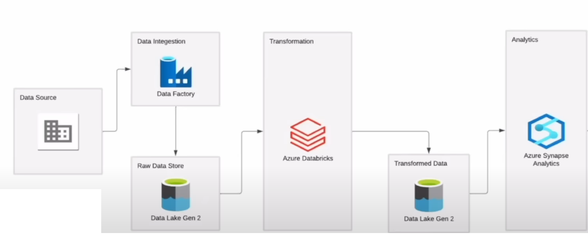

# Azure Data Pipeline

A arquitetura do projeto segue conforme imagem abaixo:

### 1 Data Source (HTTP Datasets) - 

### 2 Data Ingestion (Data Factory) -

### 3 Raw Data Store (Data Lake Gen2) -

### 4 Transformatioin (Databricks) - 

### 5 Transformed Data (Data Lake Gen 2) - 

### 6 Analytics (Synapse Analytics) - 

### 7 Dashboard (Power BI) -
